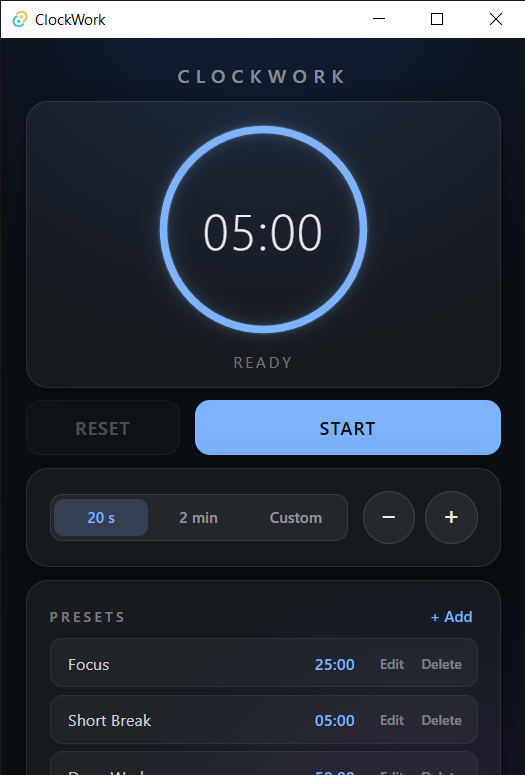

# ClockWork

A modern desktop focus timer built around customizable durations, presets, and a visual countdown experience.

🚧 **ClockWork is currently under active development.**

## Preview



## Features

- Visual circular countdown timer
- Quick timer duration selection
- Custom timer controls
- Adjustable timer duration
- Customizable presets
- Add, edit, and delete presets
- Visual timer progress tracking
- Completion alarm
- Desktop application interface

## Built With

- React
- TypeScript
- Vite
- Tauri
- CSS

## Getting Started

### Prerequisites

Make sure you have Node.js and the Tauri development requirements installed.

### Installation

Clone the repository:

```bash
git clone https://github.com/Resurrector/ClockWork.git
cd ClockWork
```
